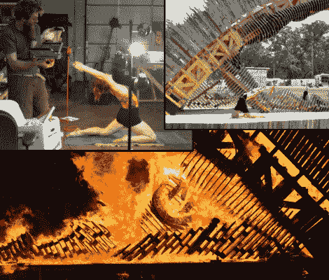

# 用 Kinect 和 CNC 创建和燃烧巨型模型雕塑

> 原文：<https://hackaday.com/2011/06/08/create-and-conflagrate-giant-modeled-sculptures-with-kinect-and-cnc/>

夏天到了，随之而来的是一群疯狂的人去参加疯狂的节日，并且(经常)伴随着疯狂的音乐焚烧疯狂的雕塑！本着这种精神，[马修·古德曼]最近参与了德克萨斯州的燃烧的另一边社区，为他的第一个大型模拟像建筑做准备。该项目需要一个巨大的拱门，两侧是两个人形人物，因为他一直在 Kinect 中工作[Matt]决定尝试从 Kinect 网格数据中对人物进行物理建模。

在配准深度和图像相机之后，设置捕捉例程来记录、获取。从深度相机中获取基于层的网格，并制作关键点检测器[Matt]准备开始从 Kinect 获取真实世界的数据。[Matt]用他当地[Austin hacker space](http://www.atxhackerspace.org/index.php/Main_Page)的备件箱建造的贫民窟稳定摄像机，开始收集三张 1.5 千兆字节的迷人[KT]的扫描照片，她是这座雕塑的模特。

一旦网格导入到 sketchup 中，它们就可以合并并平滑成一个连贯的形式。这个模型被分割成可数控的零件(马特和他的团队称之为“女士钻头”)，然后被送到当地的制造商和 T2 的数控加工厂。然后，400 多块木头被运到 flipside，有条不紊地搭建起来，并在活动结束时迅速点燃。

我们已经看到了一对[夫妇](http://hackaday.com/2009/11/18/argh-thar-be-a-big-wheel/)[的](http://hackaday.com/2011/02/16/black-rock-city-navigator/)[实在](http://hackaday.com/2010/03/15/mondo-spider/) [有趣](http://hackaday.com/2011/02/14/pedal-powered-el-wire-bike/) [燃](http://hackaday.com/2010/09/14/quadbike-bigger-is-better/) [男人](http://hackaday.com/2010/09/30/dazzling-coat-sure-to-be-in-demand-with-pimps-everywhere/) [项目](http://hackaday.com/2010/10/06/pyrosphere-at-burning-man-2010/)，但这可能是最短命的结局了。今年夏天，请继续关注更多疯狂的黑石城创作。另外，不要忘记查看[Matt]的[网站](http://craneium.net/index.php?option=com_content&view=article&id=105)了解更多详情。