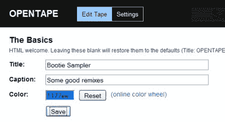

# 使用 opentype 创建您自己的播放列表托管服务

> 原文：<https://hackaday.com/2008/08/27/create-your-own-playlist-hosting-service-with-opentape/>

当 [Muxtape](http://muxtape.com/) 休息一会儿来解决与 RIAA 的问题时，Lifehacker 有一个[关于安装和运行](http://lifehacker.com/5041781/host-your-own-music-playlist-with-opentape ) [Opentape](http://opentape.fm/) 的分步指南，这是一个类似于 Muxtape 的开源 PHP web 应用程序。把事情掌握在自己手中，创建自己版本的播放列表托管天堂。由于 Opentape 是开源的，您可以对其进行修改，使其成为更好的应用程序。也许你的作品会比 Muxtape 更受欢迎……也会导致 RIAA 出现同样的问题。

*   [永久链接](http://lifehacker.com/5041781/host-your-own-music-playlist-with-opentape)