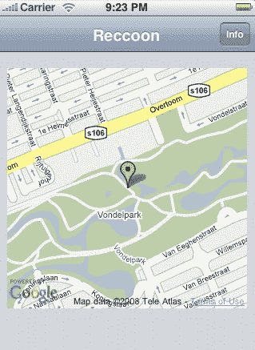

# 为 IPhone 创建 Web 应用程序

> 原文：<https://hackaday.com/2008/07/19/creating-web-applications-for-the-iphone/>

[Dominiek ter Heid]想要为 iPhone 开发一个集成了 GPS 的应用程序原型。他进行了试验，并提出了一个循序渐进的教程，介绍如何创建一个 web 应用程序，通过使用 JavaScript 和 AJAX 将 GPS 信息推送到他的 iPhone 上。本教程将为那些想玩 iPhone 3G 的网络黑客省去很多麻烦。使用 [Cocoa Touch](http://www.mahalo.com/Cocoa_Touch) 和 [CSS/JavaScript 包 IUI](http://code.google.com/p/iui/) ，他成功创建了一个看起来像 iPhone 本地的网络应用程序，并且能够获取 GPS 信息。该应用集成了[谷歌地图 API](http://code.google.com/apis/maps/) 和[地理名称数据库](http://www.geonames.org)。我们期待看到这个原型将激发的创造性应用的类型。你想为 iPhone 创建什么样的网络应用程序？

[via [digg](http://digg.com/programming/iPhone_App_Development_for_Web_Hackers)

*   [永久链接](http://dominiek.com/articles/2008/7/19/iphone-app-development-for-web-hackers)