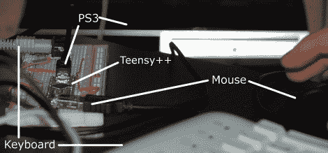

# PlayStation 3 的定制控制器

> 原文：<https://hackaday.com/2010/04/25/custom-controllers-for-playstation-3/>

[Matlo]想出了一个办法，在 PlayStation 3 上使用 PS/2 键盘和 USB 鼠标。这项艰巨的工作由一个小小的板来处理，这个板正成为[和控制黑客](http://hackaday.com/2010/04/09/snes-controller-usb-accelerometer/)的一个流行选择。它与键盘和鼠标接口，翻译它们的输入，并向 PS3 发送操纵杆按钮命令。他仅限于映射 PS3 控制器的输入，但这仍然是足够的选项，可以很好地与第一人称射击游戏配合，特别是如果你习惯在 PC 上而不是在控制台上玩游戏。如果你想试试这个，去谷歌代码页[下载源代码](http://code.google.com/p/diyps3controller/)。