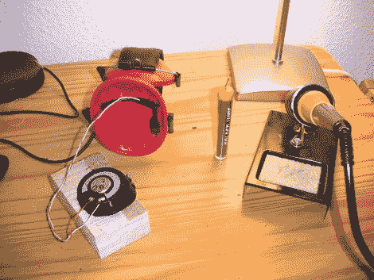

# 定制耳机解决电线纠结

> 原文：<https://hackaday.com/2010/05/01/custom-headphones-solve-wire-tangles/>

我们经常听到的一个抱怨是耳塞的线缆在背包里纠缠在一起。[Andrew] [遇到了](http://www.outsideworld.org/blog.php?id=32)这种“意大利面条”式的电线问题，他也想戴着耳机听他的音乐——耳塞通常不舒服。后一个问题可以通过将扬声器放在折叠式护耳器内来解决，电缆通过 3.5 毫米的断开连接来管理。

对于那些无法制作可拆卸耳机但仍为纠结的耳机线所困扰的人，我们推荐[合适的电线缠绕技术](http://www.youtube.com/watch?v=GiPRIxR--DU)和[小型携带袋](http://images.anandtech.com/reviews/gadgets/2008roundup/ZuneEarbuds.jpg)。有了这两者的结合，我们再也没有纠结的线缆了。