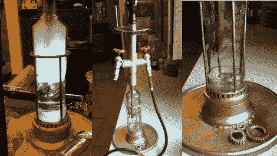

# 定制工业水烟袋

> 原文：<https://hackaday.com/2010/12/29/custom-made-industrial-hookah/>

自 16 世纪发明以来，水烟袋一直是工匠们炫耀技能的一种方式，他们通过创造华丽、精致和实用的艺术品来展示自己的技能。这个烟斗是在[水烟袋 subreddit](http://www.reddit.com/r/hookah) 上发现的，它是通过回收一个旧伏特加酒瓶，以及装饰和重新利用一些管道项目拼凑而成的。一些收尾工作，如发光二极管和齿轮的基础上，以及一套转向阀的软管插头给这个水烟一个非常独特的外观。

一如既往，我们 Hackaday 不推荐或提倡吸烟，不管水烟筒里装的是什么。但是，不管你是否抽烟，最终的产品都是值得欣赏的。休息之后，一定要看看更高分辨率的图片。

 