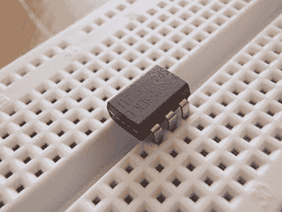

# 仅使用 Dremel 的定制微控制器

> 原文：<https://hackaday.com/2012/01/25/custom-microcontroller-using-only-a-dremel/>

看看这款 6 引脚 MSP430 微控制器。你说什么？TI 不做 6 针 MSP430？的确，德州仪器不做，所以[Greg]拿起他的 Demel 和一个切割轮，[切碎一个更大的 uC 以得到这个包](http://blog.greg.so/2012/01/making-6-pin-msp430-value-line-device.html)。

一开始听起来可能有点疯狂，但是当你仔细想想，这并没有什么特别的。如今 DIP 元件上的塑料封装大多是空的。相比之下，进行计算的硅芯片非常小，通常安装在器件的正中央。[Greg]只需剪掉八个不需要的大头针(每端四个)。

嗯，这可能是一种延伸，称他们是不必要的，因为他切断了接地和电压引脚。他通过利用在这个准系统 RFID 标签中使用的 I/O 引脚的相同属性来解决这个问题。你可以通过 I/O 注入能量，我们敢打赌，如果你愿意，你可以很容易地将这个切碎的 MSP430G2211 用作 RFID 标签。

[谢谢伊恩]