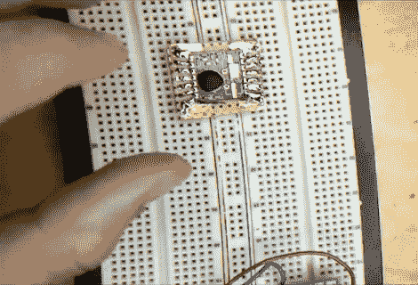

# 剪下你自己的分线板

> 原文：<https://hackaday.com/2011/03/03/cutting-out-your-own-breakout-boards/>

[Caleb]制作原型时需要使用一些表面贴装元件。他没有买分线板，而是自己做了一个，没有做任何蚀刻。休息后，他在视频中展示了使用[铜带为电路板](http://www.youtube.com/watch?v=dLBB1r3jWoI)布线的过程。这是一种非常有趣的方法，需要一把锋利的刀和一只稳定的手。

他使用常规的原板作为基板，并在没有铜垫的一侧涂上一层铜带。从那里，他为 DIP 引脚标题戳洞。现在是时候做一些切割了。[Caleb]移除了会落入表面贴装器件引脚之间的铜带。然后，他用一点焊料将它钉在适当的位置，并画出从零件到引脚接头的轨迹。移除部分后，他用马克笔在每条线之间剪下废料。他留下的是一组薄走线，将表面贴装元件的每个引脚连接到相应的通孔引脚接头。

这是非常耗时的，但话说回来，[将跳线焊接到小间距元件](http://hackaday.com/2010/12/15/developing-a-sega-game-gear-flash-cartridge/)也是如此。

[https://www.youtube.com/embed/dLBB1r3jWoI?version=3&rel=1&showsearch=0&showinfo=1&iv_load_policy=1&fs=1&hl=en-US&autohide=2&wmode=transparent](https://www.youtube.com/embed/dLBB1r3jWoI?version=3&rel=1&showsearch=0&showinfo=1&iv_load_policy=1&fs=1&hl=en-US&autohide=2&wmode=transparent)