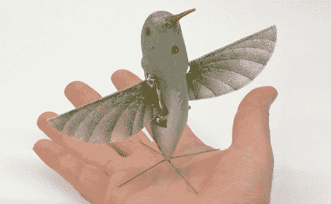

# DARPA 的蜂鸟间谍机器人

> 原文：<https://hackaday.com/2011/02/22/darpas-hummingbird-spybot/>

不，这不是什么奢侈的鱼饵，这是美国政府监视 T2 人民敌人的最新方法。蜂鸟机器人在录制视频时像真正的蜂鸟一样飞行没有任何问题。它是由一家名为 Aerovironment 的公司开发的[,作为国防高级研究计划局(DARPA)合同的一部分。当然，细节是稀缺的，但你可以看到设备飞来飞去，同时在休息后广播其视频。当然，它发出的声音比你想象的蜂鸟发出的声音要大得多，但这只是它们公开展示的版本，对吗？](http://www.avinc.com/media_gallery/videos/uas#)

自从几年前该公司获得合同以来，它确实取得了很大进展。我们假设蜂鸟是投入到他们的扑翼机项目的研究成果的实现。这些 2009 年水星计划的概念证明展示了一个受控环境中的有翼飞行器。看到今年的模型在户外飞行是非常漂亮的。

【yotuube = http://www . YouTube . com/watch？v=aEHI_pB3Br4 & w=470]

[谢谢 DMO]