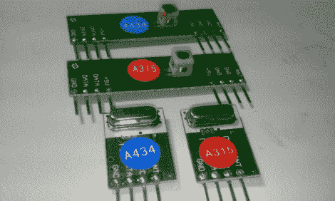

# 通过射频通信进行数据确认

> 原文：<https://hackaday.com/2010/10/18/data-confirmation-with-rf-communications/>

[拉斐尔]建造了一个使用无线电频率进行通讯的系统。他使用的廉价接收器/发送器对的代码已经有了一些纠错功能，但有时整个信息会被接收器错过。他着手[使这些射频通信更加强大](http://arduitter.blogspot.com/2010/10/rf-links-reliable-messaging.html)。

一年多以前，我们研究了如何将这些相同的发射器与 Arduino 一起使用。[Rafael]有类似的设置，但由于它们是单向的，他选择使用两对进行双向通信(每对以不同的频率工作以避免干扰)。在一端，一台计算机将数据传输到位于远程位置的 Arduino。他的确认协议依赖于随机生成的消息标识符。计算机将不断传送同样的信息。Arduino 不断接收这些信息，并将它们与上一次成功接收的信息进行比较。如果匹配，则认为数据传输成功，Arduino 会向计算机发回确认信息，然后计算机开始传输下一条信息。

这不是一个特定于应用程序的协议。为了演示起见，[Rafael]构建了一个快速家庭自动化设置，用它来操作室内灯。