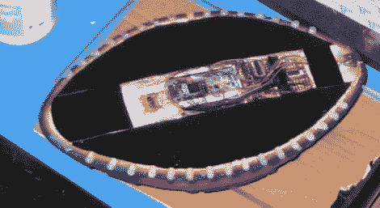

# 数据记录足球

> 原文：<https://hackaday.com/2011/01/09/data-logging-football/>

[Ben Kokes]组装了一个硬件包来捕捉足球的数据。在一个 Nerf 足球的中心，他为加速度计、陀螺仪和电子罗盘腾出了空间。这三个都可以捕获 3 轴数据，并且与环绕圆周的 led 一起，它们由 XMEGA192 微控制器控制。

这让我们回想起内置速度传感器的棒球首次上市的时候……这种黑客技术有大规模营销的潜力吗？也许吧，但前提是 225 美元的传感器价格大幅降低。当我们第一次开始阅读描述时，我们希望[Ben]已经编写了一个解释器，可以从数据中呈现 3D 回放视频。他没有这样做，但从他收集的数据图表来看，我们不认为功能是不可能的。我们会祈祷好运的。