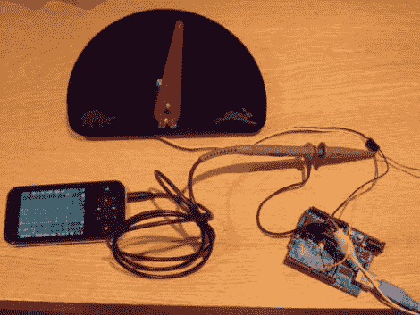

# 用 Python 实现数据采集和可视化

> 原文：<https://hackaday.com/2011/04/27/data-scraping-and-visualization-with-python/>

[Greg] [用他的激光切割机](http://gadgetlabs.tumblr.com/post/4832211954/using-python-and-an-arduino-to-get-data-from-pachube)为自己制作了一个小指示盘，并想用它来可视化服务器性能和负载信息。然而，在开始将其用于服务器监控之前，他认为应该在一个更简单的数据集上测试他的数据解析技能。

Pachube 有丰富的信息，可以免费用于你想做的任何项目，所以[Greg]开始寻找一些有趣的东西来跟踪。最终，他找到了一艘油轮的数据输入，并在他的刻度盘上显示出船的速度。他使用 Python 脚本与 Pachube API 进行交互，该 API 被提供给他的 Netduino 板。然后，伺服电机根据输入的数据改变转盘的位置。由于大型油轮不经常改变速度，这个实验有点令人失望。他搜索了一下，调到另一个跟踪新西兰风速的频道，得到了更好的结果。

他的未来计划包括将它直接连接到他的网络，并最终用它来监控他的服务器…至少在追踪随机数据馈送的新鲜感消失后。

他的所有代码都可以在 GitHub 上获得，他很高兴为任何感兴趣的人制作一个标尺，尽管他目前没有列出价格。