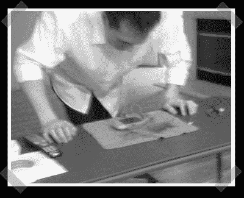

# DDR Pacman(又名 DDR Pad Rewiring)

> 原文：<https://hackaday.com/2007/12/15/ddr-pacman-aka-ddr-pad-rewiring/>

【杰森】让[用他的](http://www.instructables.com/id/SGJ82JUFA0CV5XF/)低科技但有趣的黑客技术让他的 Gameboy advance 使用 DDR pad 玩吃豆人游戏。他拿了一个 15 美元的 DDR pad，把它掏空，直接连接到他想用作按钮的每个箔片上。在他的项目中，他只是简单地将每个 pad 直接连接到 Gameboy 上的 DPad 按钮。这真的是一个预制版本的[fbz]区域开关，她为她的[背包带 wifi 探测器](http://www.engadget.com/2005/09/13/how-to-embed-a-wifi-detector-into-a-backpack-strap/)建造的。顺便说一句，Instructables 的[matt]想让我告诉你们，他们正在赠送一台价值 15000 美元的 Versalaser。

*   [永久链接](http://www.instructables.com/id/SGJ82JUFA0CV5XF/)