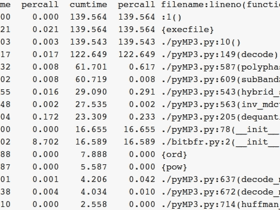

# 用 Python 解码 MP3

> 原文：<https://hackaday.com/2010/10/02/decoding-mp3-in-python/>

我们都听它们，但是你知道 MP3 文件的压缩是如何工作的吗？[Portalfire]想要找到答案，同时磨练他的 Python 技能。他一直在研究 Python 语言的 MP3 解码器。到目前为止，他已经取得了一些成功，第一个可用的解码器[的时钟速度仅比实时时钟慢 34 倍。但是从那以后，](http://portalfire.wordpress.com/2010/08/26/decoder-first-pass-complete/)[的一点优化改进使](http://portalfire.wordpress.com/2010/08/27/first-round-of-speed-ups/)慢了 10 倍。

当然，这还不是一个可用的模块，但他学习算法的目标已经达到了。结合阅读标准和查看来自其他项目的代码使之成为可能。未来，他计划用 H.264 编解码器做同样的事情。