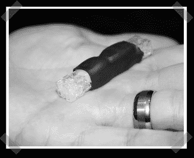

# Defcon 15:利用认证系统

> 原文：<https://hackaday.com/2007/08/04/defcon-15-exploiting-authentication-systems/>

【Zac Franken】做了一个关于认证系统的精彩演讲。(读卡器、生物识别系统等)。在很好地介绍了各种访问控制系统之后，他演示了一个优秀的利用工具。他没有关注访问机制，而是利用了阅读器安装安全性的不足。大多数读卡器由一个塑料盖和一对螺丝固定。在里面，阅读器电线是脆弱的。[Zac]为阅读器布线组装一个相当于键盘嗅探器的东西。有了这个小装置，他就能够收集访问代码并利用它们来开发阅读器认证系统。

操作是这样的:安装嗅探器。让它收集一些代码。作为回报，[Zac]能够使用他自己的卡成为伪认证的卡所有者，限制和允许对其他卡的访问。就是这样。不用偷偷溜到人家后面看他们的卡，用螺丝刀几分钟就好。

他没有发布设计，仅仅是因为防止这种拦截/控制机制的措施将会非常昂贵。