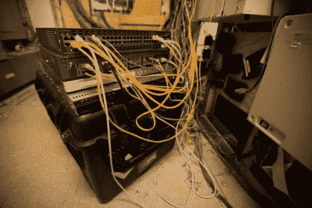

# Defcon 16:网络操作中心掠影

> 原文：<https://hackaday.com/2008/08/11/defcon-16-glimpses-of-the-network-operations-center/>

《连线》的《威胁等级》带我们进行了一次 Defcon 网络运营中心的[照片之旅，提供了一个最大的计算机安全公约之一的独特幕后视角。Defcon 网络运营中心由一个名为“打手”的志愿者组织运营。他们利用高科技和低技术资源，如](http://blog.wired.com/27bstroke6/2008/08/a-first-ever-lo.html)[思科](http://www.mahalo.com/Cisco)光纤交换机和武装警卫，保护路由器和防火墙，保持运营平稳安全。

*   [永久链接](http://blog.wired.com/27bstroke6/2008/08/a-first-ever-lo.html)