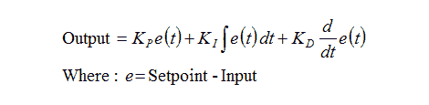

# 看看新的 Arduino PID 库，揭开 PID 控制的神秘面纱

> 原文：<https://hackaday.com/2011/07/21/demystifying-pid-control-with-a-look-at-the-new-arduino-pid-library/>

我们一直躲在舒适的空调房里，等待美国大部分地区的炎热天气过去。幸运的是，我们正忙着在我们的提示框中加入一些很棒的链接。

[Brett]向我们发送了一份关于他在新的 Arduino PID 库方面的工作的说明。他是原始图书馆的作者，最近决定是时候彻底重写了。但是一路上，他花时间解释 PID 控制和他在开发过程中所做的选择。

我们在这里看到很多 PID 控制器，比如这个基于路由器的浓缩咖啡机插件。比例-积分-微分控制器是一种确保您想要从设备中获得的控制在实践中实际实现的方法。他们监控一个过程，并随着时间的推移积累结果，以便考虑未来的事件。从我们刚刚描述的内容中，你可以看出为什么这个主题需要去神秘化。

让自己全神贯注于[布雷特的]文章。他很好地讨论了每个问题，并使用大量易于理解的图表来显示代码的每个部分都要克服的障碍。