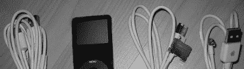

# 设计挑战奖更新增量

> 原文：<https://hackaday.com/2006/11/29/design-challenge-prize-update-delta/>

好了伙计们，我终于可以*宣布[黑客日设计挑战赛](http://www.hackaday.com/2006/11/15/hackaday-design-challenge-yes-a-contest/)的所有奖项了！我一直在等着在宣布之前把事情处理好——所有的东西都到了，这是一个非常甜蜜的收获。*

 *1.  法比安的日租 iPod Nano
2.  制作控制器
3.  制作雏菊 mp3 播放器套件
4.  相扑全能豆袋
5.  120 LED 分类包装

如果你很忙，也许你只是不知道这些东西有多甜。

法比安好心地同意放弃她自己的日刻 iPod nano。它已经被使用过，内部被彻底检查过，但除此之外它没有动过。

[MAKE](http://makezine.com) 给了我们一个他们[新的开源 MAKE 控制器](http://www.makezine.com/controller/)——我打开了他们送来的那个，非常可爱。55Mhz Atmel SAM7X CPU 在子板上，主板上有你想要的每种连接的端子，以及 USB、以太网、CAN、串行…他们还送来了他们新的[雏菊 MP3 播放器](http://www.makezine.com/daisy/)套件。不像控制器，这个要装在一起。

sumolounge.com 的安德鲁用他们的一个 T2 相扑全能豆袋给我们牵线搭桥。这东西太棒了。这是我见过的最大的豆包。(我可能要给获胜者再买一个，我女儿已经为它疯狂了)

最后，[艾伦电子项目](http://alan-parekh.vstore.ca/)的【艾伦】给了我们一套他的 [120 LED 产品组合](http://alan-parekh.vstore.ca/product_info.php/cPath/4_8/products_id/31)以及一个方便的电阻包，可以和 5v 直流一起使用。这套设备甚至包括一些 13000mcd 白色发光二极管，用于制作自己的便携式晒黑设备。

你是怎么赢得这些甜蜜的东西的？你[送来一份设计](http://www.hackaday.com/2006/11/15/hackaday-design-challenge-yes-a-contest/)！你的期限是 12 月 25 日！*