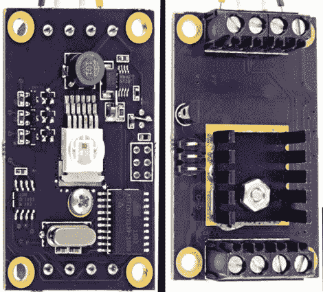

# 可控 RGB LED 驱动板的设计

> 原文：<https://hackaday.com/2011/03/30/designing-a-controllable-rgb-led-driver-board/>

[Paul]写信告诉我们他和几个朋友一起制作的 LED 驱动板。合作者对低功率 led 的每瓦流明额定值(或缺少额定值)不满意，并着手寻找更好的解决方案。他们选择了结实的 ASMT-MT00，它在一个封装中包含了所有三个二极管，所有的引脚都在表面贴装封装的一侧，散热片在另一侧，每瓦 30 流明。有了这些，他们开始为刺眼的强光设计主板。

该板的下侧包括一个散热器。为了驱动 led，[Paul]采用了 LM3407 恒流驱动器。制造商建议对 LED 封装中的每种颜色使用其中一种芯片。[Paul]构建了一个电路，允许他在每个 LED 周围布线，使系统只需一个低端驱动器即可工作。从那里，ATtiny2313 通过 RS485 协议提供可寻址控制。印刷电路板两端的螺丝端子允许它与其他模块链接在一起，他们已经开发出一个基本的 PureData 程序，一旦完成制造，就可以处理多个电路板。