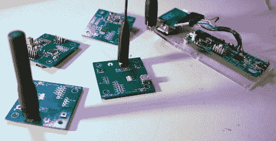

# 设计更智能的 RF 收发器

> 原文：<https://hackaday.com/2012/02/08/designing-a-smarter-rf-transceiver/>

两个月前，我们展示了一款基于微芯片 MRF49XA 的[收发器，许多反馈被发送到【hpux735】上，要求在系统上添加一些大脑。[hpux735]决定，如果他要这样做，不妨去的距离，使一个](http://hackaday.com/2010/12/09/designing-an-rf-transceiver/)[原生 USB 收发器。](http://alternet.us.com/?page_id=1494)

原型模型设计用于 Atmel AT90USBKey，并使用 LUFA USB 框架。修改了协议和数据包格式，并使用查找表构建了一个[汉明码实现](http://en.wikipedia.org/wiki/Hamming_code)来提供错误控制。最后，一旦原型准备就绪，[hpux735] [创造了一些令人敬畏的小 PCB](http://alternet.us.com/?p=1533)，其中包含 AVR、无线电、天线连接和 blinky 灯(没有 blinky 灯的项目是不完整的)都准备好了。

这个项目已经走了很长一段路，涵盖了 3 个博客页面，使用了相当多的带状电缆，但当一个计划走到一起时，你就会爱上它。