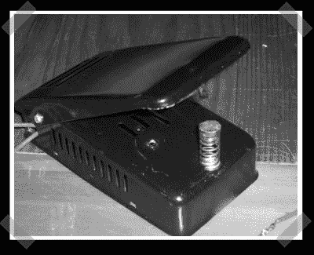

# 台式焊接压机

> 原文：<https://hackaday.com/2008/03/08/desktop-soldering-press/>

【kruser 495】贴出[这张](http://www.instructables.com/id/Desk-top-Soldering-Press-with-L.E.D/)有趣的说明书，是关于用缝纫机踏板制作桌面焊锡机的。它使用一大块碳来创建一个 diy 高功率冷热风格的焊接表面。直到顶部被按下以完成电路才起作用。看起来它只对导线连接有用，但仍然很有趣。

*   [永久链接](http://www.instructables.com/id/Desk-top-Soldering-Press-with-L.E.D/)