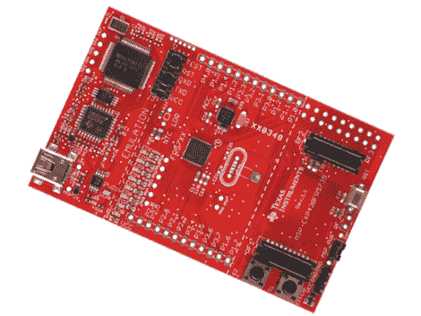

# Devboard 交易:TI 实验板 15 美元(半价)

> 原文：<https://hackaday.com/2011/06/17/devboard-deal-ti-experimenter-board-for-15-50-off/>

等待的人会得到便宜的东西。如果你已经盯上了 TI 实验板(MSP-EXP430FR5739)，现在是扣动扳机的时候了。您可以使用优惠券代码 MSP 430 _ FRAM[获得五折优惠](http://e2e.ti.com/support/microcontrollers/msp43016-bit_ultra-low_power_mcus/f/166/p/117134/416050.aspx#416050)。这将总价格拉低到 14.50 美元~~加上运费~~，一些读者报告免费送货。

该板采用升级的 MSP430。它没有使用闪存，而是使用了铁电随机存取存储器(FRAM ),这可以启动这些简单芯片的节能功能。

我们之前发布过德州仪器的一些交易，比如[发布了仅售 4.30 美元的 Launchpad](http://hackaday.com/2010/06/22/ti-makes-a-big-bid-for-the-hobby-market/) ，以及 evalBot 的优惠券交易[。在这些帖子中有大量的线程报告了运输需要多长时间，以及代码运行得有多好。所以，请留下礼貌的评论，分享你对这笔交易的想法。](http://hackaday.com/2010/10/04/125-off-the-evalbot-is-a-steal/)

当然，如果你有一个，我们想看看你用它做什么。不要忘记写下你的项目，并[提交一份提示](http://hackaday.com/contact-hack-a-day/)。