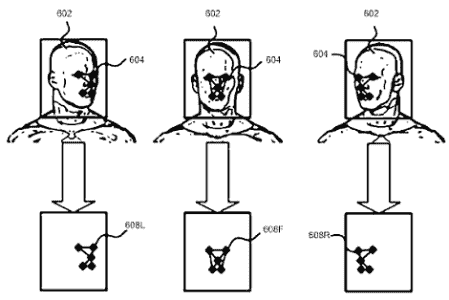

# 微软偷了 Kinect 吗？

> 原文：<https://hackaday.com/2011/07/14/did-microsoft-steal-the-kinect/>

2009 年，当微软忙于设计和营销 Kinect 时，来自哥伦比亚波哥大的发明家、修补匠、自称极客的卡洛斯·安佐拉(Carlos Anzola)多年来一直致力于为个人电脑开发几乎相同的手势界面。他的发明，人机界面电子设备，或 HiE-D——发音为“Heidi”——在微软发布 Kinect 之前几年就能识别手势。

在 2007 年开发出他的手势识别设备后，微软对[卡洛斯]的设备表现出了兴趣——甚至要求提供原型。微软建议他为自己的技术申请专利。[Carlos]就这么做了，在 Natal 项目宣布的前两天向美国专利商标局[和 T2 世界知识产权组织](http://www.google.com/patents?id=mRzXAAAAEBAJ&printsec=abstract&source=gbs_overview_r&cad=0#v=onepage&q&f=false)递交了专利申请，而在[微软申请他们的 Kinect 专利](http://www.google.com/patents?id=KP3SAAAAEBAJ&printsec=frontcover&dq=2010197399&hl=en&ei=7EkfTo5h6fDSAfXBycQD&sa=X&oi=book_result&ct=result&resnum=1&ved=0CCgQ6AEwAA)之前整整七个月。

自从 Kinect 发布以来，[Carlos]一直在波哥大展示 HiE-D，并在 Youtube 上发布了一些他的技术视频，其中一个可以在下面看到。你也可以去他的 Youtube 频道看一些精彩的演示。

[https://www.youtube.com/embed/f5jfOJ3TwyI?version=3&rel=1&showsearch=0&showinfo=1&iv_load_policy=1&fs=1&hl=en-US&autohide=2&wmode=transparent](https://www.youtube.com/embed/f5jfOJ3TwyI?version=3&rel=1&showsearch=0&showinfo=1&iv_load_policy=1&fs=1&hl=en-US&autohide=2&wmode=transparent)

[Carlos]在计算机视频、动画和 3D 处理方面享有盛誉，一位患有技术恐惧症的美国牙医找到了他，他想要一台更快的激光扫描仪来对他的病人的牙齿进行 3D 建模。[卡洛斯]建造了一个改进的激光扫描仪，[在哥伦比亚的新闻广播 *Caracol Noticias*](http://www.youtube.com/watch?v=vf0CwmshgA4) 上做了专题报道。[卡洛斯]不得不处理一点来自技术恐惧牙医的特征蠕变，因为他现在想不使用鼠标操纵他的病人的口腔模型。[Carlos]受到了*少数派报告*计算机界面的巨大影响，他决定与计算机交互的最简单方式是手势界面。

[Carlos]着手制造一种装置，可以让一个人只用手势控制电脑。他的 HiE-D 会是一个惊人的简单，但非常聪明的装置。HiE-D 向用户投射一个红外点或星座图案。红外线对人眼来说是不可见的，但很容易被 HiE-D 上的摄像头捕捉到。这就是微软 Kinect 的工作原理，可以在夜拍模式下被[摄像机看到。当相机检测到这个星座的变化时，图像就会被处理，并可以识别用户面部、手部甚至全身的参考点。](http://www.youtube.com/watch?v=nvvQJxgykcU)

在听说 HiE-D 之后，微软向[卡洛斯]示好，并索要了一台样机。他给了微软一个 HiE-D 的原型，根据[卡洛斯]的说法，它在 2007 年 2 月被带到了雷德蒙——在纳塔尔项目宣布的两年多以前。在那一年与微软会面两次后，微软告诉他，为他的发明申请专利并不是一个坏主意。

虽然微软方面的任何行动都是猜测，但我们可以说 Kinect 与 HiE-D 非常相似。两者都使用投射在用户身上的红外点“星座”,并且都能够检测用户的“骨骼”以进行运动控制。下图来自 HiE-D 专利，展示了如何追踪面部运动。

今天，[Carlos]正在与几家有兴趣生产 HiE-D 的公司进行谈判，他说它的售价仅为 50 美元，而微软 Kinect 的售价为 140 美元。HiE-D 没有摄像头来捕捉用户的视频，所以用 HiE-D 玩[装扮](http://hackaday.com/2011/07/07/play-dress-up-with-kinect/)是不可能的。这不会是太大的缺点，因为我们见过的一些[最令人印象深刻的](http://hackaday.com/2011/07/02/3d-display-using-a-kinect/) Kinect 黑客根本不会随着 HiE-D 而改变

[Carlos]说他已经和波士顿的几个律师联系过了，他们认为他可以起诉微软侵犯专利。在这一点上，他还没有决定如何继续——微软确实有足够的资金来针对谷歌的安卓系统为自己辩护，并为其使用 T2 的 3D 地图为自己辩护。如果我们是卡洛斯，我们也会很怀疑我们的机会。

在 Kinect 发布之前，黑客社区掀起了一阵兴趣——发布了[奖金](http://hackaday.com/2010/11/04/kilobuck-open-kinect-project-prize/)来开发一个开源驱动程序，以便 Kinect 可以在封闭的 Xbox 生态系统之外运行。Kinect 正式发布几小时后就发布了一个驱动程序，这一事实证明了人们对手势识别和*少数派报告*界面的兴趣。在 Hack A Day，看到修补者和极客重新想象现有产品并不罕见；已经有了微软 Surface 的[版本](http://hackaday.com/2011/04/16/the-basics-of-building-a-multitouch-table/)，以及对 Playstation Move 进行逆向工程的尝试[。其中大多数都是对现有想法或设备的重新想象，这使得[卡洛斯]的建造更加令人惊叹。](http://hackaday.com/2011/03/13/reverse-engineering-the-playstation-move/)

我们每天都被提醒匿名家庭修补者的能力。对我们来说，“黑客”是一个创意、调查和理解的标签。像卡洛斯一样，我们中的一些人最终偶然发现了一个新的想法，这个想法将改变人类与环境的互动方式。虽然[卡洛斯]可能得不到他应得的意外之财，但我们仍然非常嫉妒他独自在一个小作坊里创造东西的能力，这将改变人们与计算机的交互方式。