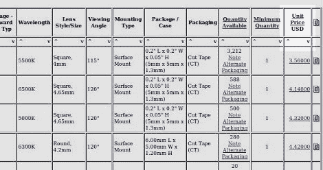

# Digikey 按价格脚本排序

> 原文：<https://hackaday.com/2010/05/11/digikey-sort-by-price-script/>

有没有人觉得电子零售商 SparkFun 提倡脚本来帮助 Digikey 拥有按价格排序的功能有点讽刺？不管怎样，[重申](http://blog.makezine.com/archive/2010/05/how-to_sort_by_price_on_digikey.html)现在[火狐](http://www.mozilla.com/en-US/firefox/personal.html)(我们也听说[谷歌 Chrome](http://www.google.com/chrome) )使用 [Greasemonkey](https://addons.mozilla.org/en-US/firefox/addon/748/) 插件的用户可以排序 [Digikey](http://www.digikey.com/) 项目。就个人而言，我们这里的一些人本质上只是 Mouser 的粉丝。

[感谢 Charper 和 Mohonri 和 Satiagraha，图像信用制作]