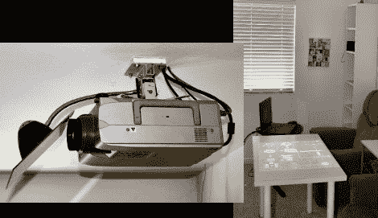

# 无烟数字游戏桌，只有一面镜子

> 原文：<https://hackaday.com/2012/03/26/digital-gaming-table-made-with-no-smoke-just-a-mirror/>

周末期间，拥有一个数字游戏桌的想法在[机器人男孩]的脑海中挥之不去，他利用手头的材料很快就想出了这个主意。他已经有了一台安装在天花板上的投影仪，正好放在他的咖啡桌上方。通过将那件家具换成白色的宜家桌子，并在投影仪上增加一面镜子，他现在有了他一直在寻找的虚拟游戏表面。镜子支架只不过是一个台灯，包括一个弹簧夹和灵活的颈部。他把镜子热粘在上面，然后把它固定在投影仪的天花板上。由于背投屏幕很常见，所以所有数字投影仪都能够镜像和旋转正在显示的图像，以便图像以正确的方向出现在桌面上。

我们喜欢它的外观，但这只是数字游戏项目的一部分。我们认为这张桌子需要一些互动。我们经常看到通过网络摄像头处理红外线来实现这一点。多点触摸选项不适用于标准桌子，因为摄像头需要位于半透明表面的另一侧。但是如果你不介意使用手写笔的话[这种红外白板技术可以工作](http://hackaday.com/2010/11/19/projector-introduces-augmented-reality-to-reality/)。