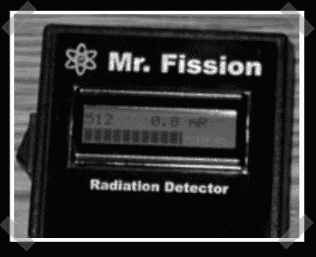

# 数字盖革计数器

> 原文：<https://hackaday.com/2007/11/19/digital-geiger-counter/>

担心辐射水平？我不是，但我还是想造一个。[裂变先生](http://n1vg.net/geiger/index.php)是由 [OpenTracker](http://n1vg.net/opentracker/index.php) 项目背后的同一个人建造的。[Scott]基于[Russel E. Cliff]建造的[条形图盖革计数器](http://www.cbtricks.com/~ab7if/bgc/bgc.htm)。两者都使用像 LND712 那样的标准盖革管。电子管在高电压下工作——对于旧的电子设备来说很容易，但对于今天的低电压设备来说，这是一个稍微有点困难的挑战。[Scott]使用原始项目中的高压电源，并围绕一个良好的 ol '摩托罗拉 HC86 系列处理器构建其余部分。[Scott]使用为冷阴极灯设计的逆变器电源的想法绝对是一个有趣的想法。

*   [永久链接](http://n1vg.net/geiger/index.php)