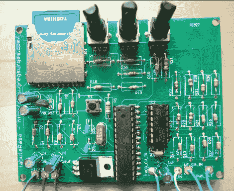

# 数字波表振荡器

> 原文：<https://hackaday.com/2011/02/25/digital-wavetable-oscillator/>

[tabulaRasa](http://gregsurges.com/circuitry/tabularasa/) 是一个数字波表振荡器，具有频率控制、波表选择和插值功能。这个装置被分成两部分。一个是 pcb，带有大量电阻、3 个电位计、 [ST TL074 JFET](http://www.st.com/internet/analog/product/65356.jsp) 运算放大器、atmega328 和一个 SD 插座。

第二部分是用于计算机的软件，允许您编辑或创建自己的波形。有 3 种不同的控制模式。断点，允许你设置波形点，最多允许 16 个。Harmonic 允许对 16 个谐波相关的正弦波进行振幅控制，最后，第三种模式允许您载入简短的声音剪辑。

一旦你高兴了，保存到一个 SD 卡，并弹出到董事会，你就可以做一些噪音。项目页面的最后写道“tabulaRasa 已经处于开发的最后阶段，很快就会上市。”所以你现在还不能买到，但是如果你感兴趣的话，[Greg]有一个 kickstarter 页面设置，你可以在那里找到定价的细节。