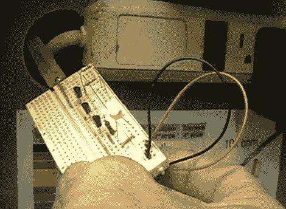

# [Dino]构建了一个简单的非接触式电压检测器

> 原文：<https://hackaday.com/2011/09/20/dino-builds-a-simple-non-contact-voltage-detector/>

[迪诺]带着他的黑客一周系列的另一部分回来了，在这一集里，他正在进行他承诺将是最后一个基于晶体管的项目——至少在一段时间内。

在下面嵌入的视频中，他展示了一个自制的电压检测电路,这是他使用三个 BC547 NPN 晶体管构建的。尽管电路很简单，但还是很有用。在一端，该器件有一个小铜带，连接到第一个晶体管的基极。该晶体管的发射极以菊花链形式连接到第二个晶体管的基极，依此类推，直到到达 LED 指示灯。

正如[Dino]的一位观众所说，电路的功能如下:

> 前端铜带形成电容器的一侧，然后当你把它带到电压附近时，一个超级微小的电流在“电容”的空气电介质之间流动。这是用高增益 BC547 和 viola 放大的，LED 灯亮了。”

由于微小的电流被放大了许多倍，即使电压很低，LED 也会亮起。虽然我们不一定会把生命托付给[迪诺的]电压检测器，但我们相信它会不时派上用场。

[https://www.youtube.com/embed/2PGDFBl5iz8?version=3&rel=1&showsearch=0&showinfo=1&iv_load_policy=1&fs=1&hl=en-US&autohide=2&wmode=transparent](https://www.youtube.com/embed/2PGDFBl5iz8?version=3&rel=1&showsearch=0&showinfo=1&iv_load_policy=1&fs=1&hl=en-US&autohide=2&wmode=transparent)