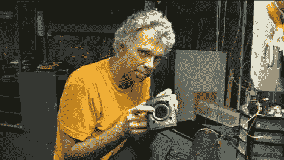

# [Dino]庆祝光电话诞生 131 周年

> 原文：<https://hackaday.com/2011/06/03/dino-celebrates-the-131st-anniversary-of-the-photophone/>

Dino Segovis 来信分享了他的黑客一周系列的另一部分，尽管这一部分非常及时。

131 年前的今天，[亚历山大·格雷厄姆·贝尔]向世界展示了光电话。作为光纤技术的先驱，[贝尔]极其重要的发明可以很容易地在你的车库里复制，正如[迪诺]向我们展示的那样。

最初的光电话是用扩音器和接收器焦点处的晶体硒电池构建的，然而这个版本可以用容易获得的部件制成。[迪诺]把他的笔记本电脑安装到一个扬声器上，他在扬声器上安装了一面镜子，然后把它放在阳光下。镜子的振动调节太阳光，将其反射到一个太阳能电池上，该电池位于一根长的黑色 PVC 管的末端。太阳能电池的引线被送入一个放大器，放大器后面是一个扬声器，扬声器播放音频。

演示进行得很顺利，虽然有些人可能对这项技术不感兴趣，但想象一下 131 年前它会是多么不可思议！