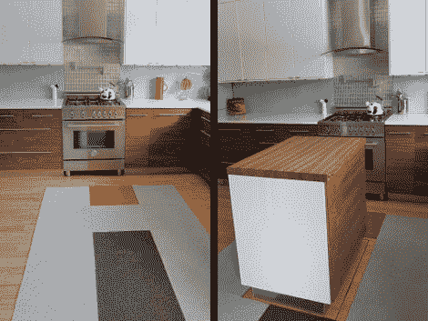

# 消失的厨房岛

> 原文：<https://hackaday.com/2011/06/14/disappearing-kitchen-island/>

[蒂姆·泰勒]一直在重新装修他的家，在这里和那里添加一些花哨的自动化。但是到了厨房，他全力以赴，安装了一个由 iPhone 控制的消失岛。在休息后的视频剪辑中，您可以看到[Tim]从他的智能手机中拨出一些额外的计数器和存储空间。一次点击使它从深处慢慢上升，在上升的过程中掉落地毯。

厨房正下方是一个未完工的储藏室。[Tim]在上面的地板上框了一个洞，并以大约 380 美元的价格购买了一台二手剪式升降机来完成这项繁重的工作。它运行平稳，没有那么大的噪音。如果他决定卖掉这个地方，这肯定会成为一个有趣的特写。

我们认为隐藏黑客的机械部件的储藏室有一个隐藏的入口，这是一个很好的触摸。你必须穿过地下室的台球室才能进入，转动球架打开入口的门闩。

[https://www.youtube.com/embed/x3nVeBMwkGY?version=3&rel=1&showsearch=0&showinfo=1&iv_load_policy=1&fs=1&hl=en-US&autohide=2&wmode=transparent](https://www.youtube.com/embed/x3nVeBMwkGY?version=3&rel=1&showsearch=0&showinfo=1&iv_load_policy=1&fs=1&hl=en-US&autohide=2&wmode=transparent)

[谢谢玛丽]