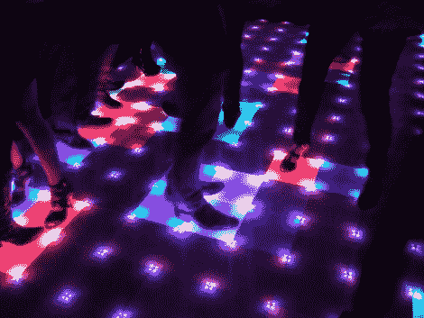

# 迪斯科没有消亡:Diy 舞池出现在学生聚会上

> 原文：<https://hackaday.com/2011/06/18/disco-isnt-dead-diy-dance-floor-spotted-at-student-parties/>

如果你的派对不包括舞池里互动闪烁的灯光，那它就太逊了。[马里奥]和[卢卡斯]不想举办蹩脚的派对，所以他们招募了一些同学来[建造一个互动舞池](http://www.bastli.ethz.ch/index.php?page=BIRD) ( [翻译](http://translate.google.com/translate?js=n&prev=_t&hl=en&ie=UTF-8&layout=2&eotf=1&sl=auto&tl=en&u=http%3A%2F%2Fwww.bastli.ethz.ch%2Findex.php%3Fpage%3DBIRD))。最终的派对作品是 4 米乘 2.5 米(对美国人来说大约是 13 英尺乘 8 英尺)，包括 160 个发光的正方形。但是真正让这个项目变得沉重的是电子设备。

在纸板底座的下面铣出一系列的口袋和通道来容纳各种元件。如果你仔细观察，你会发现 8 个 AVR 微控制器控制 led，8 个 CPLDs 管理重量传感器，使地板互动，以及一个 FPGA 和嵌入式计算机将一切联系在一起。它是可移动的，在聚会上很受欢迎，到目前为止，它似乎可以承受偶尔洒出来的饮料。

你不能分享一个没有视频的项目。休息后再看。

[https://www.youtube.com/embed/um1bMXSOXw8?version=3&rel=1&showsearch=0&showinfo=1&iv_load_policy=1&fs=1&hl=en-US&autohide=2&wmode=transparent](https://www.youtube.com/embed/um1bMXSOXw8?version=3&rel=1&showsearch=0&showinfo=1&iv_load_policy=1&fs=1&hl=en-US&autohide=2&wmode=transparent)