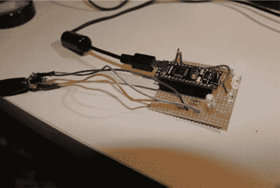

# DIY 放大器 Minder 关闭你的立体声当你忘记

> 原文：<https://hackaday.com/2011/10/08/diy-amplifier-minder-turns-off-your-stereo-when-you-forget/>

[zmashiah]在他的客厅里有一个很好的 Nova 电子管放大器，他经常在听完音乐后忘记关掉它。当这种情况发生时，他感到内疚，因为这不仅缩短了他的音响的寿命，而且也不完全是最环保的行为。为了不让他的接收器闲置太久，他造了一个简单的装置，当他忘记的时候会自动关机。

他将一个 Arduino 连接到接收器的线路电平输出，每两秒钟采样一次音频。当五分钟没有音频信号时，Arduino 会向接收器发送红外命令，将其关闭。

他说，他意识到在这个应用程序中使用 Arduino 可能有些过分，但他宁愿多花一两美元，而不是花几个小时钻研 AVR 汇编代码。虽然我们都赞成效率，但我们不能完全否认这个逻辑——时间就是金钱！

[zmashiah]很友好地包括了他的原理图以及他的项目代码，所以如果你偶尔忘记关闭你的红外设备，一定要检查一下。