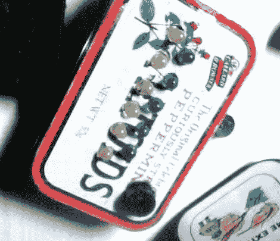

# DIY 二元闹钟小到可以放进你的口袋

> 原文：<https://hackaday.com/2011/11/04/diy-binary-alarm-clock-small-enough-to-fit-in-your-pocket/>

【Linux-dude】[一直想有一个二进制时钟](http://www.instructables.com/id/Arduino-Binary-Alarm-Clock-pocket-sized/?ALLSTEPS)，但又不想花钱让别人给他做。此外，他还在寻找一款可以随身携带的紧凑型闹钟，而不是依赖于酒店房间里的闹钟。

受到这些年来他看到的其他二进制时钟项目的启发，他开始建造自己的二进制时钟，他想把它放在一个 Altoids 罐中。他的二进制时钟使用 Arduino Duemilanove(完全适合锡)来记录时间和控制指示灯。如你所料，发光二极管排成两行，分别代表小时和分钟。一个小的压电扬声器作为报警蜂鸣器，应该足以唤醒大多数人，尽管对于深度睡眠者来说可能需要更大的扬声器。

我们没有看到提到任何类型的电池组或电源插头，所以我们不太清楚[linux-dude]如何保持他的时钟充满活力。此外，缺乏实时时钟是我们感到困惑的事情。虽然 Arduino 确实有一个可以使用的时钟功能，但 RTC 可能更适合他——如果他一次只离开一两天，那么少量的漂移可能不是问题。