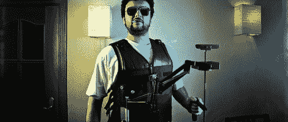

# DIY 相机稳定器让你的视频以低廉的价格免费抖动

> 原文：<https://hackaday.com/2011/03/31/diy-camera-stabilizer-keeps-your-video-shake-free-on-the-cheap/>

基于背心的商用相机稳定系统非常昂贵，有时价格标签在 700-800 美元之间。摄影师[Miguel Vicente]有一个库存相当充足的工作室，他认为不可能花那么多钱买一个钻机，所以他简单地建造了自己的。

老实说,“简单地”有点说错了。从下面嵌入的构建视频来看，这个系统看起来相对复杂。该装置由钢管、定制弹簧和一件非常时髦的背心构成，几乎可以向任何方向调节。他已经测试了它 2.5 公斤(大约 5.5 磅)的重量，但他说在这个重量下很难控制。[Miguel]说 1.5 公斤(3.3 磅)是一个更合理的限制，稳定器在这个重量或更低的重量下工作得很好。

虽然在我们看来它相当不错，但他说有进一步改进设计的计划。他想强调的一点是稳定器接受非对称摄像机设置的能力，即摄像机附带照明和麦克风。

留下来看一个关于建造过程的“精彩”短片，以及一个更全面记录稳定器建造的视频。

对更多的 DIY 摄像器材感兴趣？看看这个[头顶摄像机小车](http://hackaday.com/2011/03/18/diy-camera-dolly-frees-up-your-hands-to-take-care-of-the-important-stuff/)和这个 [DIY 万向架](http://hackaday.com/2011/02/09/four-axis-camera-mount-rides-on-a-wire/)我们不久前还特别介绍过。

[通过[使](http://blog.makezine.com/archive/2011/03/diy-steadycam-arm.html)

【维梅奥 http://vimeo.com/21390411 w = 470】

[vimeo http://vimeo.com/21316057 w=470]