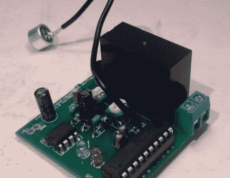

# diy 理发推子是送给你生活中最懒的人的理想礼物

> 原文：<https://hackaday.com/2011/12/20/diy-clapper-is-the-ideal-gift-for-the-laziest-person-in-your-life/>

如果你还没有完成你的圣诞购物，你可能要考虑构建[【Alan from Japan】实现经典的“克拉珀”。它的主题曲深深印在任何一个还记得 80 年代的人的脑海里，拍板是一个很棒的装置，当然可以让“L”变得懒惰。](http://kalshagar.wikispaces.com/Clapclap)

想找个借口玩玩运算放大器和麦克风[Alan]决定基于这个类似的电路制作他自己版本的拍板，他称之为 ClapClap。他使用驻极体麦克风构建了该设备，该麦克风通过一个小型放大器将信号传输到 ATmega328 微控制器的 ADC。mcu 不断轮询 ADC，寻找拍手的声音，这是一种可行的解决方案，但不如[Alan]希望的那样干净。

他又回到绘图板，这次是围绕 ATtiny2313 微控制器构建电路。大多数其他组件保持不变，尽管新的、更小的设计展示了他在 Seeedstudio 制作的一些不错的 PCB。这个版本的 ClapClap 不是不断轮询 ADC，而是在来自麦克风的信号中寻找峰值，以识别拍手声。

他说新版本运行得很好，尽管在他永远躺在沙发上之前，他还有一两个软件缺陷需要修复。