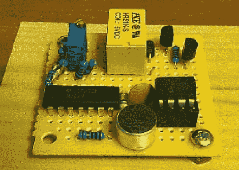

# diy 理发器

> 原文：<https://hackaday.com/2011/02/07/diy-clapper/>

[Patrick 的]最新 Instructable 带我们做了一个 [clap clap on / clap clap off](http://www.instructables.com/id/How-to-make-a-Clap-Clap-on-Clap-Clap-Off-switch-/) 类型的开关电路，类似于电视上有时流行的商业产品。他通过使用标准驻极体麦克风、半个 LM324 运算放大器、电压比较器和 PIC 微控制器来实现这一点。

该器件的操作与其布线一样简单，麦克风拾取声音并产生信号，该信号被去除 DC 成分并馈入运算放大器，经过两级放大后，信号通过电压比较器，如果声音足够大，pic 上的计时器就会触发。在指定的时间内拍两下，然后微处理器打开一个继电器，这个继电器可以切换你的外部设备(记住负载)。

在最后一页[Patrick]也给出了如何使用 555 定时器和一些触发器制作一个单独的 clap 开/关变量的大致轮廓。休息之后加入我们的快速视频，一定要看看这个。

[https://www.youtube.com/embed/4dA7FjI7nSg?version=3&rel=1&showsearch=0&showinfo=1&iv_load_policy=1&fs=1&hl=en-US&autohide=2&wmode=transparent](https://www.youtube.com/embed/4dA7FjI7nSg?version=3&rel=1&showsearch=0&showinfo=1&iv_load_policy=1&fs=1&hl=en-US&autohide=2&wmode=transparent)