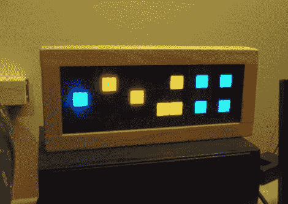

# DIY 时钟复制品比真品更好

> 原文：<https://hackaday.com/2011/07/11/diy-clock-replica-is-better-than-the-real-thing/>

在第一次看到 TIX 钟后，[【Gweedo Steevens】非常想要一个](http://www.gweeds.net/tixclock/tixclock.html)，但对支付 ThinkGeek 看似高昂的要价[不感兴趣。他认为自己造一个不会太难，所以他决定试一试。](http://www.thinkgeek.com/homeoffice/lights/7437/)

该时钟依靠 27 个 led 来显示时间，这些 led 被复用以充分利用他的 ATMega16 微控制器的可用 IO 引脚。一旦他对试验板上的功能感到满意，他就将 led 移植到一块 perf 板上，并为控制器电路蚀刻出自己的 PCB。

他用一个办公室高架照明格栅来分隔发光二极管，提供良好的均匀光段。他在前面放了一块透明的有机玻璃来覆盖 led，但后来换成了一块更暗的，以便在日光下更好地观看。

成品棒极了，在我们看来甚至比零售版还要好——干得好极了！

[via [HackedGadgets](http://hackedgadgets.com/2011/07/10/diy-tix-clock/)