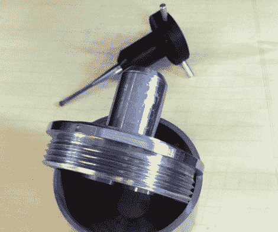

# DIY 数控触摸探头

> 原文：<https://hackaday.com/2011/06/09/diy-cnc-touch-probe/>

[Dennis]最近投资了一些钱在他的锡格河 SX3 轧机的 Tormach 工具系统上，以使他的工具更换更容易。虽然成套工具允许他在更换工具时容易地考虑高度偏移，但是他没有快速、可靠的方法来相对于工件定位主轴。厌倦了为每个轴手动寻找工件的边缘，[他为自己建造了一个 DIY 触摸探针来自动化这个过程](http://fadedbits.com/2011/02/touchprobe/)。

探测器操作背后的理论非常简单。在探头外壳中，垂直于探头尖端安装了三个导电杆。每根杆都位于两个金属球之间，形成一个完整的电路。当探针接触到他的铣削材料的边缘时，电路断开，向他的 CNC 控制箱发送信号。

探针由几个不同的部分组成，由铝或黑色 delrin 铣削而成。[Dennis]说，在组装好所有部件后，探头的跳动量是不可接受的，所以他做了一些调整，现在跳动量已经减少到大约 0.00025”，完全在他将要做的任何工作的可接受公差范围内。

一定要去看看他的网站，因为那里有更多关于探测器构造的图片和视频。

与此同时，请继续阅读，观看完成的探针运行的快速视频。

[https://www.youtube.com/embed/_m4quM9Lvog?version=3&rel=1&showsearch=0&showinfo=1&iv_load_policy=1&fs=1&hl=en-US&autohide=2&wmode=transparent](https://www.youtube.com/embed/_m4quM9Lvog?version=3&rel=1&showsearch=0&showinfo=1&iv_load_policy=1&fs=1&hl=en-US&autohide=2&wmode=transparent)