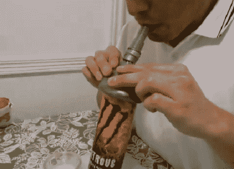

# DIY 咖啡抓手

> 原文：<https://hackaday.com/2010/11/04/diy-coffee/>

在 Hackaday，我们喜欢人们自制精致、昂贵的技术设备。通过收集一些咖啡渣、一个气球、一些塑料管和他的肺，[卡洛斯]提供了一个制作自己的咖啡渣机器人手的好方法。受美国芝加哥大学、康奈尔大学和 iRobot 合作的启发，我们[以前报道过](http://hackaday.com/2010/10/26/robot-gripper-uses-coffee-to-pick-up-anything/)，他是一个机器人和一个真空泵远离他们的设置。查看他的博客，获取组件列表以及一些帮助构建顺利进行的提示。休息后请务必观看视频。

[通过[使](http://blog.makezine.com/archive/2010/11/diy_universal_robot_gripper.html)

[https://www.youtube.com/embed/q-gHLYIWrrs?version=3&rel=1&showsearch=0&showinfo=1&iv_load_policy=1&fs=1&hl=en-US&autohide=2&wmode=transparent](https://www.youtube.com/embed/q-gHLYIWrrs?version=3&rel=1&showsearch=0&showinfo=1&iv_load_policy=1&fs=1&hl=en-US&autohide=2&wmode=transparent)