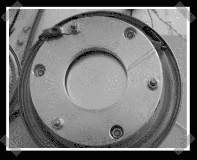

# diy 电容话筒

> 原文：<https://hackaday.com/2007/08/09/diy-condensor-microphone/>

【威斯】送来了他的[最新](http://wiesi.uttx.net/diy/ultech_cdmic/index.html)电容话筒。他没有使用预先构建的组件，而是从头开始构建(除了分立组件)。他正在进行第二次迭代，情况看起来相当不错。这往往是业余无线电爱好者追求的那种项目…哦，等等，我就是其中之一。

*   [永久链接](http://wiesi.uttx.net/diy/ultech_cdmic/index.html)