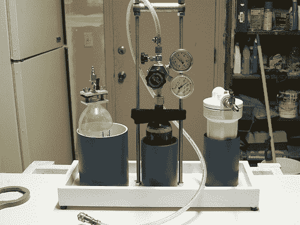

# DIY 充气水果

> 原文：<https://hackaday.com/2011/02/17/diy-fizzy-fruit/>

邪恶疯狂科学家实验室的[Rich]用他的 CO2 吸入器向水果中注入 CO2，让他的孩子吃水果更愉快。他观察了制造软饮料和充气啤酒的相同原理，决定在他的厨房里建造一个二氧化碳压力舱。他收集了一些容易找到的组件来建造他的装备，包括一个家用滤水器外壳和一个彩弹枪的二氧化碳气瓶。对于那些不熟悉这一过程的人，他有一些有用的提示，指出冷藏的水果比温热的水果吸收气体更快，在选择碳酸化什么时，考虑水果的含水量很重要。

一旦[Rich]把所有东西都安全地连接起来，并检查有无泄漏，水果就放进去了。大约半小时到一小时后，水果被碳化了，这让他的孩子们非常高兴。这看起来像是一个快速而有趣的项目，对成人和孩子都一样，可以很容易地适应繁忙的周末日程。

[via Neatorama]