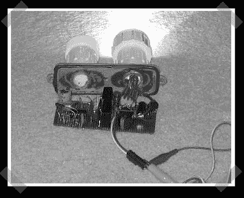

# DIY HID 镇流器

> 原文：<https://hackaday.com/2008/06/10/diy-hid-ballast/>

HID 灯在功耗和流明输出上比卤素灯有较大优势。不幸的是，镇流器组件并不便宜。[布莱恩]一直在[为他的山地车制造他自己的镇流器](http://forums.mtbr.com/showthread.php?t=269251)。我们找不到关于他设计的更多信息，但我们确实找到了一些有趣的东西。本文件列出了[对镇流器的要求](http://members.misty.com/don/hidexp.html#1)。[这里是](http://www.repairfaq.org/sam/jshidbal.htm)一个旧的 HID 镇流器设计开始滚动。请记住，灯需要高电压，除非你知道自己在做什么，否则不要玩它。如果你更愿意使用现成的组件，检查 HID 潜水灯，我们写了一个[而回](http://www.hackaday.com/2006/09/03/hid-dive-light/)。它使用相当便宜的镇流器/灯组合。

*   [永久链接](http://forums.mtbr.com/showthread.php?t=269251)