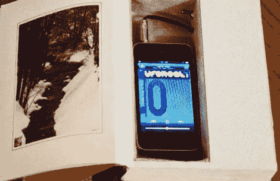

# DIY 隐藏式书架音箱

> 原文：<https://hackaday.com/2011/05/11/diy-hidden-bookshelf-speakers/>

[Steve]厌倦了看他工作室里的扬声器，开始四处寻找更具美感的东西。他最近收到了一套用来藏东西的镂空书籍作为礼物，他认为他可以用类似的方式解决他的扬声器问题。

他从当地一家旧货店拿了几本书，然后迅速把书页撕下来。它们被布面胶合板取代，以使设备更加坚固，同时模拟页面的外观。

他把扬声器安装在其中一本书里，然后马上安装了一个 7W 的 A 类放大器。第三本书有一个带衬垫的隔层，可以放他的 iPod，这样就完整了一套书。

[Steve]报告说扬声器几乎无法察觉，音质也不错。事实上，我们已经开始寻找一些旧书来重新利用我们的工作室。