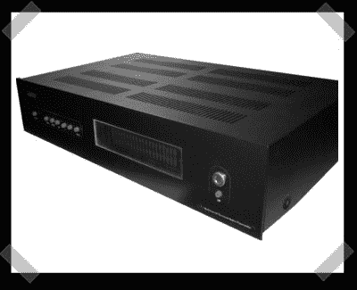

# DIY 家庭影院前置放大器

> 原文：<https://hackaday.com/2007/12/27/diy-home-theater-preamplifier/>

【戴恩】[打造](http://www.kafka.elektroda.eu/podstrony/pgapreamp.php)这款优秀的家庭影院前置放大器。他首先使用了[马克·轩尼诗]的[前置放大器设计](http://www.mhennessy.f9.co.uk/preamp/index.htm)，并添加了可选的 XLR、RCA、SPDIF 甚至 USB 音频输入。他的 DVD 播放器的离散输入提供环绕输入，模拟矩阵从 5.1 输入创建 7.1 环绕。设计非常优雅，甚至使用了 VFD 显示器，在一些滤镜的作用下呈现蓝色。我通常只买我的 HT 装备，但像这样的项目让我认真考虑从头开始重建我的整个 HT。

*   [永久链接](http://www.kafka.elektroda.eu/podstrony/pgapreamp.php)