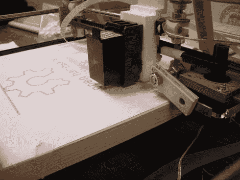

# DIY 喷墨打印机求被黑

> 原文：<https://hackaday.com/2011/06/03/diy-inkjet-printer-begs-to-be-hacked/>

[尼古拉斯·C·路易斯，帕特里克·汉南，贾里德·克努森和乔伊·马卡姆]，来自华盛顿大学的学生，最近揭开了他们合作的一个项目，[一台 DIY 喷墨打印机](http://www.thingiverse.com/thing:8542)。该小组着手构建一种低成本、开源的喷墨打印机，供个人使用，采用标准喷墨技术。他们的工作原型，如上图所示，满足所有这些要求，使其成为家庭爱好者的理想设备。

该打印机由容易获得的部件构成，如钢棒和步进电机，以及其他可以使用 RepRap 或类似机器打印的部件。Arduino Mega 管理步进器和重新调整用途的打印头，重新创建处理生成的图像。

到目前为止，这种打印机相当受欢迎，人们已经在谈论将这种设计应用于球形物体的打印(想想 EggBot)，制造直接抗蚀 PCB，等等。我们认为只需做一些小的调整，它就能成为一个很好的服装印刷商。

查看下面嵌入的视频短片，了解打印机的运行情况。

[通过[使](http://blog.makezine.com/archive/2011/06/diy-open-source-inkjet-printer.html)

[https://www.youtube.com/embed/fYeYeTGkvJM?version=3&rel=1&showsearch=0&showinfo=1&iv_load_policy=1&fs=1&hl=en-US&autohide=2&wmode=transparent](https://www.youtube.com/embed/fYeYeTGkvJM?version=3&rel=1&showsearch=0&showinfo=1&iv_load_policy=1&fs=1&hl=en-US&autohide=2&wmode=transparent)