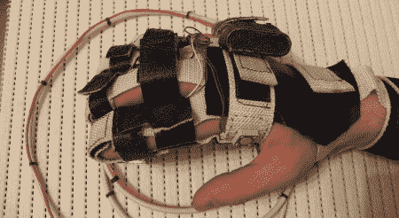

# DIY 操纵杆手套

> 原文：<https://hackaday.com/2008/07/14/diy-joystick-glove/>

【精灵】送上这款有趣的 [DIY 摇杆手套](http://texno-memory.livejournal.com/3016.html)。实际的手套开关设计没有太多细节，但从网站上的原理图来看，它似乎主要由微型开关组成，带有一些电位调节晶体管来校准 X-Y 信号。

相关:[数据手套 USB 接口](http://www.hackaday.com/2008/07/12/handusb-data-gloves-interface/)和[丁香 2 单手输入](http://www.hackaday.com/2008/07/12/clove-2-glove-for-one-handed-input/)

*   [永久链接](http://texno-memory.livejournal.com/3016.html)