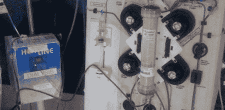

# DIY 肾脏机拯救女孩

> 原文：<https://hackaday.com/2008/08/05/diy-kidney-machine-saves-girl/>

当你需要的工具不存在时，你必须做一个。这正是两年前纽卡斯尔皇家维多利亚医院的马尔科姆·库尔特哈德医生和肾脏护士让·克罗泽所做的。

当一个太小的婴儿因肾脏衰竭而无法使用常规透析机(类似于上图)需要帮助时，这位善良的医生在他的车库里设计并制造了一台机器的较小版本[，然后用它拯救了六磅重的婴儿米莉·凯利的生命。从那以后，这种机器一直被用于类似的紧急情况。](http://news.bbc.co.uk/2/hi/health/7542404.stm)

【图片:[游牧企业家](http://flickr.com/photos/nomadicentrepreneur/2369307700/)

*   [永久链接](http://news.bbc.co.uk/2/hi/health/7542404.stm)