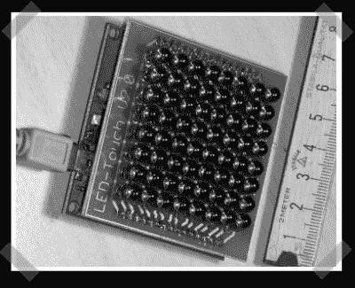

# DIY LED 多点触控面板

> 原文：<https://hackaday.com/2007/12/16/diy-led-multi-touch-panel/>

我们[提到过](http://rop.hackaday.com/2006/02/21/low-cost-sensing-and-communication-with-an-led/2)前阵子的[原版](http://cs.nyu.edu/~jhan/ledtouch/index.html) IR LED 多点触控阵列，但是我偶然发现了[这个](http://pcb-dev.com/showsite.php?open=f3c1975f2de773229d236241546dac48)由【Thomas Pototschnig】打造的 DIY 版本。它具有带 USB 2.0 的 ARM7 控制器，捕获速率为 25hz 以上。他承诺在构建下一个版本时会提供代码和原理图。

*   [永久链接](http://pcb-dev.com/showsite.php?open=f3c1975f2de773229d236241546dac48)