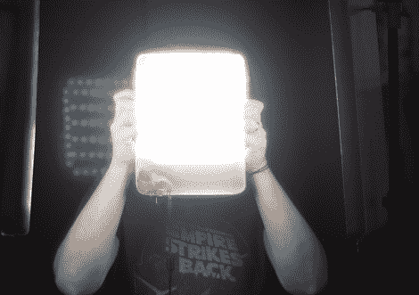

# DIY LED 摄影灯

> 原文：<https://hackaday.com/2011/11/15/diy-led-photography-lights/>

[Markus]一直垂涎于一些 LED 面板作为摄影的软光源，但作为一个业余爱好者，他不想花很多钱去买它们。他认为自己有足够的电子技术来制造自己的面板，同时在这个过程中节省了一大笔钱。

他希望将总成本控制在 100 英镑以下，所以除了 LED 灯带等新产品，他还必须使用一些闲置的东西，比如构成灯体的金属烹饪容器。虽然最初计划用于不同的项目，但事实证明烹饪容器非常适合他的照明设置，因为它们既耐用又是很好的散热材料。

构建的其余部分非常简单。[Markus]使用一个预制的 LED 调光器来控制面板的亮度，同时使用一些有色树脂玻璃来漫射光线，同时将色温带入一个更可用的范围。

虽然他没有达到 100 分，但这些灯看起来很棒——我们可能需要自己制作一些。