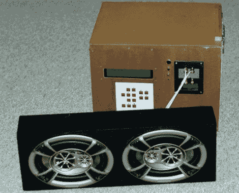

# DIY MP3 播放器表明，没有黑客永远不会过时

> 原文：<https://hackaday.com/2011/04/11/diy-mp3-player-shows-that-no-hack-is-ever-obsolete/>

[老狼]来信告诉我们他已经工作了几年的一个项目。瓦肯死亡盒子提醒人们，一旦你开始一个 DIY 项目，在合理的时间内完成它可能是个好主意，以免它有被淘汰的风险。

他的死亡盒子是一个 MP3 播放器，是他每年去瓦肯露天音乐节旅行时随身携带的。他的目标是构建一个便携式放大音乐播放器，可以由汽车电池或充电器供电。一台威盛 EPIA 的迷你 ITX 电脑充当了该设备的大脑，通过一个双通道 100 瓦的放大器从一组汽车扬声器中播放他的音乐。

[老狼]用了几年的音乐播放器，边用边改进。然而，他承认，随着 MP3 播放器价格的持续下降，他决定带一个小型便携式设备去参加 2010 年的音乐节，把盒子留在家里。

相比之下，更小更便携的设备让他的音乐盒显得笨重过时，你可能会问为什么他还留着它。我们认为每个黑客都有它的位置，虽然你不会在晨跑时把死亡盒子绑在背上，但它非常适合各种情况。这款坚固的音乐盒非常适合在您的工作室、海滩甚至建筑工地使用，在这些地方，您可能不想使用相对脆弱的设备。